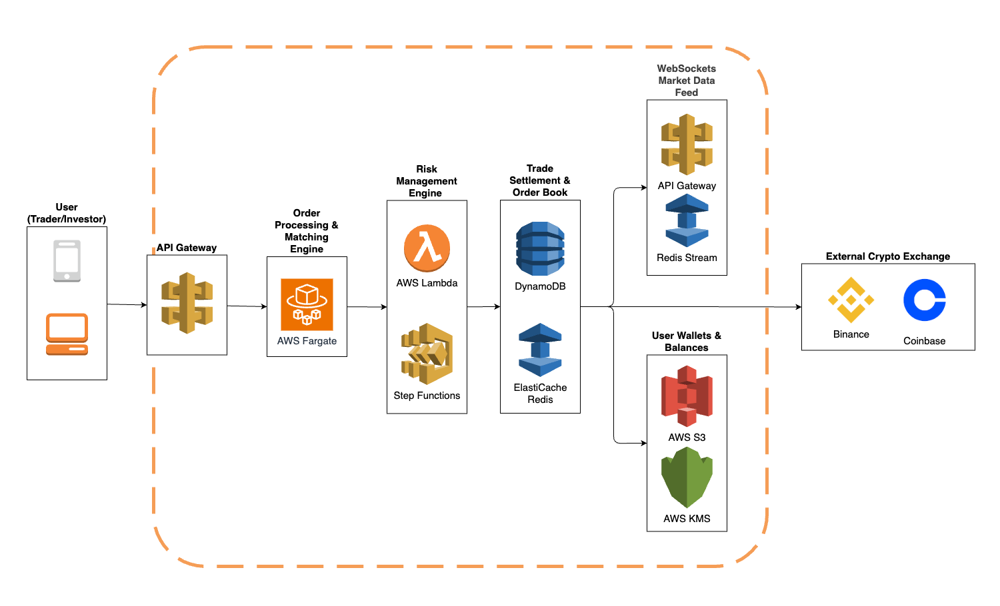

# Problem 2: Building Castle In The Cloud

Reference: ChatGPT

## Analysis
Binance Features
1. **Order Matching Engine (Spot Trading System)**: Implements an order book that updates in real time.
2. **Margin & Futures Trading**: Implements risk management systems (e.g., liquidation, margin calls).
3. **Liquidity Management & Automated Market Making (AMM)**: 
- Integrates with liquidity providers or internal market-making algorithms.
- Can support both order book-based and AMM-based liquidity models.

## Diagram

### 1. API Gateway (AWS API Gateway)
-	Handles REST API and WebSockets for order processing and real-time updates.
-	Scalability: Can handle thousands of concurrent requests.
-	Security: Integrated with AWS WAF to prevent DDoS attacks.
-	Low latency: API Gateway + AWS Lambda processing is sub-50ms in ideal conditions.

Alternative:  
- **Elastic Load Balancer (ALB)**: can handle HTTP requests but lacks WebSocket support, which is critical for real-time trading.

### 2. Order Processing & Matching Engine (AWS Fargate)
- Serverless container execution → No need to manage server.
- Auto-scales with demand to handle spikes in order traffic.
- Low latency (<10ms processing time for order matching in-memory).

Alternative:
- **EC2 Instances (Auto Scaling Group)**: requires provisioning & management.

### 3. Risk Management Engine (AWS Lambda + Step Functions)
- Event-driven → Executes only when a trade occurs, saving cost.
-	Highly parallelizable → Can handle 500 RPS without bottlenecks.
-	Step Functions orchestrate liquidation, fraud detection, and risk assessment.

### 4. Trade Settlement & Order Book (DynamoDB + Redis)
DynamoDB
-	High-speed transactions (~single-digit ms latency).
-	Auto-scales to 500 RPS.
- No need for manual scaling or maintenance.

AWS ElastiCache (Redis)
- Stores order book in-memory for <1ms retrieval time.
- Reduces DynamoDB read costs by caching frequent queries.

Alternative:
- **Amazon Aurora (PostgreSQL)**: cannot handle 500 RPS at low cost;	Transactions require disk-based I/O, increasing latency.

### 5. WebSockets Market Data Feed (API Gateway + Redis Stream)
- WebSockets via API Gateway → Supports high concurrency.
- Redis Streams → Ultra-fast, pub-sub mechanism for market updates.

Alternative:
- **Kafka for Streaming**: Higher complexity for a startup; more expensive than Redis Streams.

### 6. User Wallets & Balances (AWS S3 + AWS KMS)
AWS S3
- Cold storage of encrypted user wallet balances (reducing DB costs).
- Scalability: Can store millions of transactions.

AWS KMS
- Manages encryption keys securely.
- Ensures regulatory compliance (GDPR, SOC2).

## Scaling Plan
### 1. Scale Compute: Order Matching & Processing

**Current**: AWS Fargate

**Scale Plan**:

✅ Move to AWS EKS (Kubernetes) with EC2 Auto Scaling
-	Deploy matching engine as microservices (per trading pair).
-	Use gRPC for faster inter-service communication.
-	Enable Auto Scaling Groups (ASG) to adjust capacity dynamically.

✅ Increase Instance Size
-	Use EC2 C6i (compute-optimized) for order processing.

✅ Sharding Strategy
-	Split order matching across multiple EC2 instances based on trading pairs.

✅ Latency Optimization
-	Store active orders in Redis to reduce database lookups.
- Optimize API response times using GraphQL with data batching.

### 2. Scale Data Storage: Order Book & Trade History

**Current**: DynamoDB + Redis

**Scale Plan**:

✅ Upgrade Redis to Redis Cluster
-	Distribute order book caching across multiple nodes.
-	Use read replicas for scaling trade history reads.

✅ Move Historical Data to Amazon Aurora (PostgreSQL)
-	DynamoDB for active trades, Aurora for trade history.
-	Enable Aurora Read Replicas for horizontal scaling.

✅ Use AWS S3 for Cold Storage
-	Archive historical trade logs to reduce DB costs.

